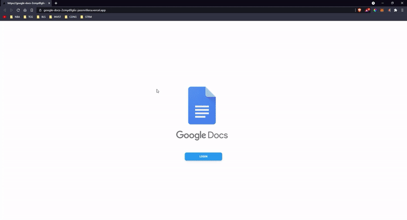

# Google Docs Clone

This Google Docs inspired website is an online word processor app. It was build with the Next.js framework, the backend utilizes Google Firebase, and the design has been made responsive through the use of Tailwind CSS.

## Features

- Reengineered a fully responsive document authoring tool using the Next JS framework for a dynamic production build
- Utilized NextAuth to enhance user security and data protections
- Implemented a third party API (React Draft Wysiwyg) to integrate a Rich Text Editor
- Deployed app through Vercel for enhanced scalability for a seamless UX
- Utilized the maintainability of Tailwind CSS for an adaptable and mobile first design

## Author

Jason Rillera: https://github.com/JasonRillera

## [Live Demo Link](https://google-docs-2cmyd0g6c-jasonrillera.vercel.app/)

